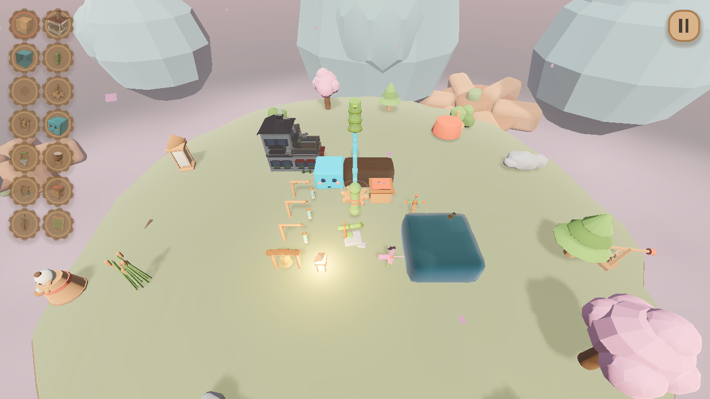

# KARAKURI STREAM

*a water garden toy* — a relaxing sandbox inspired by Japanese karakuri
automata. Drop blocks on a floating island, let water find its way through
them, and listen: everything the stream touches plays a note. There is no
goal, no score, no failure — just a small machine garden that sings.



## How it plays

Water flows from a **spout**, through **bamboo pipes**, off **jelly
trampolines**, past **sluice gates** — and everything it lands on makes a
sound. Ponds power **gears**, gears drive **music boxes** and **scoops**,
scoops ladle new streams back out of the pond: water → mechanism → music,
in a loop you build yourself.

Every impact snaps to a shared **beat grid**, so several machines play in
time; sources come in three tempos, and polyrhythms fall out naturally.
All pitched sounds draw from one **pentatonic scale** — whatever you build,
it stays consonant.

### The palette

| Block | What it does |
|---|---|
| Wood | Building block — the whole island is a marimba: placement pitch follows height |
| House | Stack and line up house cells — they merge into one building (see below) |
| Water | Still pond — powers any gear touching it; four dye colours |
| Spout | Pours a stream straight down; three tempos |
| Pipe | Self-connecting bamboo — closed, open, or **alternator** (deals water to its exits beat-by-beat) |
| Gear | Spins against water, meshes with neighbours to transfer power |
| Bell | Rings when struck by a stream or a turning gear |
| Jelly | Trampoline — a falling stream bounces up-and-over it |
| Shishi-odoshi | Fills, then tips with the classic double knock; three capacities chain into clock dividers |
| Drum | Deep taiko hit from streams or gears |
| Chime | Five fixed pentatonic notes by colour — line them up to write a melody |
| Music box | Plays a tune while a powered gear turns beside it |
| Scoop | Beside a pond and a spinning gear, ladles out a new stream — in the pond's colour |
| Sluice gate | Click it in the world to open/close a whole branch of the machine |

### Houses

You don't place a house, you place a house *cell*, and the building assembles
itself. Put two side by side and the wall between them disappears — they
become one wide house under one roof. The roof is one surface over the whole
footprint: a row gets a ridge with hipped ends, a 2×2 a hip roof, a 3×3 a
pyramid, an L-shape grows a valley — none of it special-cased.

Stack a cell and the lower roof becomes a floor. Nothing floats: a house in
mid-air grows legs down to whatever is beneath it, and an overhanging storey
braces itself with a corbel. Each building gets exactly one door and one
chimney, deterministically — a village looks identical after you reload it.

Some shapes are worth more, and the town will tell you so: a four-storey
single-cell tower earns a **spire**; a roof in the shadow of a taller part
becomes a railed **terrace**; ring an empty cell and it becomes a planted
**courtyard**; leave one cell of air between equal rooftops and **bunting**
is strung across the gap. Deterministic — find one, then build it on purpose.

### Animals

Wildlife arrives because of what you built, and does something back:

- **Birds** need a house. They perch on roofs, and a bird landing on a bell,
  chime or drum **plays it** — a second musician you didn't program.
- **A cat** moves in at two houses, walks the rooftops, and on the night map
  sits by a lit stone lantern.
- **Ducks** need a real pond (three open water cells) and paddle it.
- **A deer** only comes out when the machine is *quiet* — switching your
  garden off is the only way to see it.

### Controls

- **Left click** place · **Right click** remove · **Middle drag** orbit · **Scroll** zoom
- **1–0, -, =** select blocks · **Q** houses · click a hotbar icon again to cycle its variant
- **Ctrl+Z / Ctrl+Y** undo/redo · **H** hide UI · **U** move the sun · **P** screenshot
- **F11** fullscreen · **Esc** pause, where the journal and save/load live
- Touch: one finger orbits, two fingers pinch-zoom

### The journal

The town does things nobody asked it to — a spire, a terrace, a courtyard,
bunting — and all of them are earned by a shape, not rolled. The journal notices
the first time your garden produces one, says what happened, and keeps the list
(**Esc → Journal**). Everything you have not found yet reads `? ? ?`: naming it
would be handing out the recipe, and finding it is the game.

### Four maps

Spring (sakura & petals), Autumn (amber & falling leaves), Snow (hushed
white), Night (fireflies — percussion sparks light). Same garden, different
world; ambience and palette retune per map. Progress saves to `user://` — and
saves itself: on a timer, when the window loses focus, and when you close it.

## The sound

No looping soundtrack. A generative composer improvises over one pentatonic
collection: a slow harmonic clock wanders between its five modal rotations
(major and minor colours from the same pitches — nothing the player strikes
can clash), melodies walk stepwise in short call-and-response phrases, and
the density breathes over minutes. Instrument voices are a mix of CC0
recordings and in-house synthesis (see [CREDITS.md](CREDITS.md)).

## Running it

Made with **Godot 4.7.1** (GL Compatibility renderer, no external addons).

```
godot --path .                        # opens the main menu
godot --path . tests/regression.tscn  # regression suite → expect "REGRESS ALL OK"
```

Use an **official** Godot 4.7.1 binary for exports — the Steam build swallows
export error text. Build instructions: [BUILD.md](docs/BUILD.md).
Sửa game (thêm block, đổi màu, đổi âm): **[docs/MAINTAIN.md](docs/MAINTAIN.md)** · âm thanh: [docs/AUDIO.md](docs/AUDIO.md)
Art style bible: [artstyle.md](docs/artstyle.md) · code map: [CODEMAP.md](docs/CODEMAP.md) · development log: [plan.md](docs/plan.md)

## Project layout

```
scenes/          menu, game, block scenes
scripts/
  autoload/      grid, streams, gears, houses, wildlife, isosurface, audio, composer
  blocks/        per-block behaviour (shishi, gate, jelly, chime, ...)
  data/          block registry, variants, iso surface, house shapes, map themes
  ui/            hotbar, menus, theme
shaders/         wood / water / stream / cloud-sea
assets/          sounds, fonts (incl. the Aseprite-drawn pixel font), models
tools/           dev harnesses: perf probe, screenshot rig, font generator
tests/           regression suite
```

All third-party assets are CC0; the font is OFL — details in
[CREDITS.md](CREDITS.md). Version: 1.0.0.
